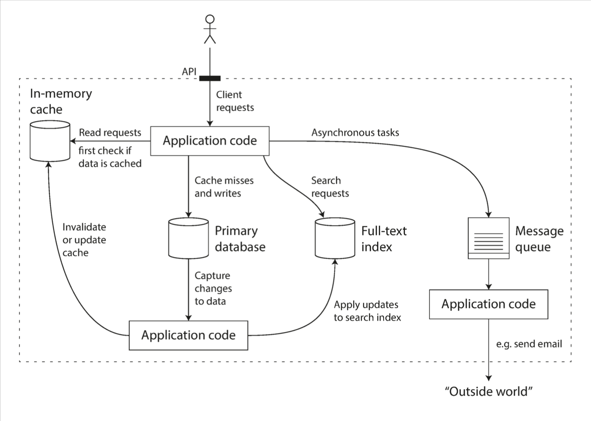

###### Reliable, Scalable, and Maintainable Applications
- A data-intensive application is typically built from standard building blocks that provide commonly needed functionality. For example, many applications need to:
    - Store data so that they, or another application, can find it again later (databases)
    - Remember the result of an expensive operation, to speed up reads (caches)
    - Allow users to search data by keyword or filter it in various ways (search indexes)
    - Send a message to another process, to be handled asynchronously (stream pro‐cessing)
    - Periodically crunch a large amount of accumulated data (batch processing)

- the boudaries and differences between **kafka** and **Redis**. *worth researching!*

- "if you have an application-managed caching layer (using Memcached or similar), or a full-text search server (such as Elasticsearch or Solr) separate from your main database, it is normally the application code’s responsibility to keep those caches and indexes in sync with the main database" --> think of it 🤓 (some packages in application responsible for various tasks, connecting and signaling each other)

- combining serveral components:

- questions that arise at the beginning of the implementing a good data system:
    - If you are designing a data system or service, a lot of tricky questions arise. How do you ensure that the data remains correct and complete, even when things go wrong internally? How do you provide consistently good performance to clients, even when parts of your system are degraded? How do you scale to handle an increase in load? What does a good API for the service look like?

- **Reliability**:
    - The system should continue to work correctly (performing the correct function at the desired level of performance) even in the face of adversity (hardware or soft‐ ware faults, and even human error)
- **Scalability**:
    - As the system grows (in data volume, traffic volume, or complexity), there should be reasonable ways of dealing with that growth
- **Maintainability**:
    - Over time, many different people will work on the system (engineering and oper‐ ations, both maintaining current behavior and adapting the system to new use cases), and they should all be able to work on it productively.

- [Orchestrating Data/ML Workflows at Scale With Netflix Maestro](https://netflixtechblog.com/orchestrating-data-ml-workflows-at-scale-with-netflix-maestro-aaa2b41b800c)

- the trade-off between write time and read time can be significantly valuable for designing systems in large scale.
where the decision to make a cache of all the tweets for a users timeline and write them immediately in cache for the followers after posting and decrease the read time on each user's home timeline request and using the cache.

- what is **fan-out load**? --> 
" In the example of Twitter, the distribution of followers per user (maybe weighted by how often those users tweet) is a key load parameter for discussing scalability, since it determines the fan-out load. Your application may have very different characteristics, but you can apply similar principles to reasoning about its load."
  -  The final twist of the Twitter anecdote: now that approach 2 is robustly implemented, Twitter is moving to a hybrid of both approaches. Most users’ tweets continue to be fanned out to home timelines at the time when they are posted, but a small number of users with a very large number of followers (i.e., celebrities) are excepted from this fan-out. Tweets from any celebrities that a user may follow are fetched separately and merged with that user’s home timeline when it is read, like in approach 1. This hybrid approach is able to deliver consistently good performance. We will revisit this example in Chapter 12 after we have covered some more technical ground.

- **throughput**: the number of records we can process per second, or the total time it takes to run a job on a dataset of a certain size

- In a batch processing system such as Hadoop, we usually care about throughput—the number of records we can process per second, or the total time it takes to run a job on a dataset of a certain size. In online systems, what’s usually more important is the service’s response time that is, the time between a client sending a request and receiving a response

- Usually it is better to use percentiles. If you take your list of response times and sort it from fastest to slowest, then the median is the halfway point: for example, if your median response time is 200 ms, that means half your requests return in less than 200 ms, and half your requests take longer than that.

- Some systems are **elastic**, meaning that they can automatically add computing resources when they detect a load increase, 

- **stateful services**: Stateful applications and processes allow users to store, record, and return to already established information and processes over the internet. In stateful applications, the server keeps track of the state of each user session, and maintains information about the user's interactions and past requests. They can be returned to again and again, like online banking or email. They’re performed with the context of previous transactions and the current transaction may be affected by what happened during previous transactions. For these reasons, stateful apps use the same servers each time they process a request from a user. If a stateful transaction is interrupted, the context and history have been stored so you can more or less pick up where you left off. Stateful apps track things like window location, setting preferences, and recent activity. You can think of stateful transactions as an ongoing periodic conversation with the same person.The majority of applications we use day to day are stateful, but as technology advances, microservices and containers make it easier to build and deploy applications in the cloud.

- **stateless services**: A stateless process or application, however, does not retain information about the user's previous interactions. There is no stored knowledge of or reference to past transactions. Each transaction is made as if from scratch for the first time. Stateless applications provide one service or function and use a content delivery network (CDN), web, or print servers to process these short-term requests. An example of a stateless transaction would be doing a search online to answer a question you’ve thought of. You type your question into a search engine and hit enter. If your transaction is interrupted or closed accidentally, you just start a new one. Think of stateless transactions as a vending machine: a single request and a response. 

- **Stateless and stateful container management**: With the growth in popularity of containers, companies began to provide ways to manage both stateless and stateful containers using data storage, Kubernetes, and StatefulSets. Statefulness is now a major part of container storage and the question has become not if to use stateful containers, but when. Whether or not to use stateful or stateless containers comes down to a matter of what kind of app you’re building and what you need it to do. Stateless is the way to go if you just need information in a transitory manner, quickly and temporarily. If your app requires more memory of what happens from one session to the next, however, stateful might be the way to go.

- The architecture of systems that operate at large scale is usually highly specific to the application—there is no such thing as a generic, one-size-fits-all scalable architecture (informally known as magic scaling sauce). The problem may be the volume of reads, the volume of writes, the volume of data to store, the complexity of the data, the response time requirements, the access patterns, or (usually) some mixture of all of these plus many more issues

- Operations teams are vital to keeping a software system running smoothly. A good operations team typically is responsible for the following, and more
  - Monitoring the health of the system and quickly restoring service if it goes into a bad state
  - Tracking down the cause of problems, such as system failures or degraded performance
  -  Keeping software and platforms up to date, including security patches
  -  Keeping tabs on how different systems affect each other, so that a problematic change can be avoided before it causes damage
  - Anticipating future problems and solving them before they occur (e.g., capacity planning)
  - Establishing good practices and tools for deployment, configuration manage‐ ment, and more
  - Performing complex maintenance tasks, such as moving an application from one platform to another
  - Maintaining the security of the system as configuration changes are made
  - Defining processes that make operations predictable and help keep the produc‐ tion environment stable
  - Preserving the organization’s knowledge about the system, even as individual people come and go

- Good operability means making routine tasks easy, allowing the operations team to focus their efforts on high-value activities. Data systems can do various things to make routine tasks easy, including:
  - Providing visibility into the runtime behavior and internals of the system, with good monitoring
  - Providing good support for automation and integration with standard tools
  - Avoiding dependency on individual machines (allowing machines to be taken down for maintenance while the system as a whole continues running uninterrupted)
  - Providing good documentation and an easy-to-understand operational model (“If I do X, Y will happen”)
  - Providing good default behavior, but also giving administrators the freedom to override defaults when needed
  - Self-healing where appropriate, but also giving administrators manual control over the system state when needed
  - Exhibiting predictable behavior, minimizing surprises

- One of the best tools we have for removing accidental complexity is **abstraction**. A good abstraction can hide a great deal of implementation detail behind a clean, simple-to-understand façade. A good abstraction can also be used for a wide range of different applications. Not only is this reuse more efficient than reimplementing a similar thing multiple times, but it also leads to higher-quality software, as quality improvements in the abstracted component benefit all applications that use it.

- Throughout this book, we will keep our eyes open for good abstractions that allow us to extract parts of a large system into well-defined, reusable components.

- In terms of organizational processes, Agile working patterns provide a framework for adapting to change. The Agile community has also developed technical tools and patterns that are helpful when developing software in a frequently changing environment, such as test-driven development (TDD) and refactoring

-  **Reliability** means making systems work correctly, even when faults occur. Faults can be in hardware (typically random and uncorrelated), software (bugs are typically sys‐ tematic and hard to deal with), and humans (who inevitably make mistakes from time to time). Fault-tolerance techniques can hide certain types of faults from the end user.

- **Scalability** means having strategies for keeping performance good, even when load increases. In order to discuss scalability, we first need ways of describing load and performance quantitatively. We briefly looked at Twitter’s home timelines as an example of describing load, and response time percentiles as a way of measuring performance. In a scalable system, you can add processing capacity in order to remain reliable under high load.

- **Maintainability** has many facets, but in essence it’s about making life better for the engineering and operations teams who need to work with the system. Good *abstractions* can help reduce complexity and make the system easier to modify and adapt for new use cases. Good operability means having good visibility into the system’s health, and having effective ways of managing it.