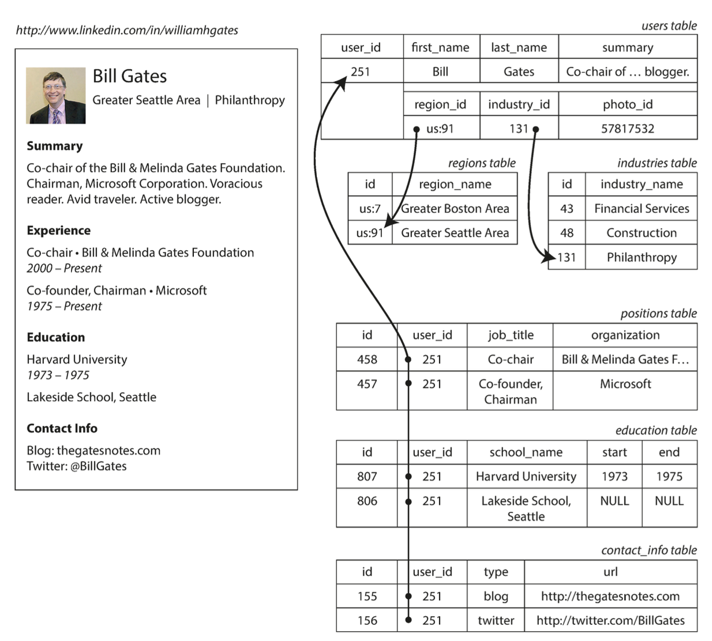

###### Data Models and Query Languages

- **Data models** are perhaps the most important part of developing software, because they have such a profound effect: not only on how the software is written, but also on how we think about the *problem* that we are solving.

- As an application developer, you look at the real world (in which there are peo‐ ple, organizations, goods, actions, money flows, sensors, etc.) and model it in terms of objects or data structures, and APIs that manipulate those data struc‐ tures. Those structures are often specific to your application.

-  When you want to store those data structures, you express them in terms of a general-purpose data model, such as JSON or XML documents, tables in a rela‐ tional database, or a graph model.

- The engineers who built your database software decided on a way of representing that JSON/XML/relational/graph data in terms of bytes in memory, on disk, or on a network. The representation may allow the data to be queried, searched, manipulated, and processed in various ways.

- On yet lower levels, hardware engineers have figured out how to represent bytes in terms of electrical currents, pulses of light, magnetic fields, and more.

- In this chapter we will look at a range of general-purpose data models for data stor‐ age and querying

- The best-known data model today is probably that of SQL, based on the relational model, data is organized into relations (called tables in SQL), where each relation is an unordered collection of tuples (rows in SQL).

- transaction processing (entering sales or banking transactions, airline reservations, stock-keeping in warehouses) and batch processing (customer invoicing, payroll, reporting).

- **indexing**:
  - In simple terminology, an index maps search keys to corresponding data on disk by using different in-memory & on-disk data structures. 
  - ...

- One-to-many relationships forms a tree structure.
- relational scheme for *One-to-many* relatioship
- 
- tree scheme for *One-to-many* relationship
- 

- *Semi-structured data* is not “in-between” structured and unstructured data. Instead, this is a form of structured data that does not conform to the structure schema of databases.

- Documents in a document database are roughly equivalent to the programming concept of an object. 

- 